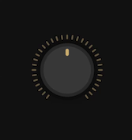

# snabbdom-knob
a snabbdom based knob




## usage

```js
import html from 'https://cdn.skypack.dev/snabby?min'
import knob from './knob.js'


const model = knob.init({ value: 50 }) // value is between 0 and 100


// later, render like this:
knob.view(model, update)

```

see `example.html` for a complete working example
